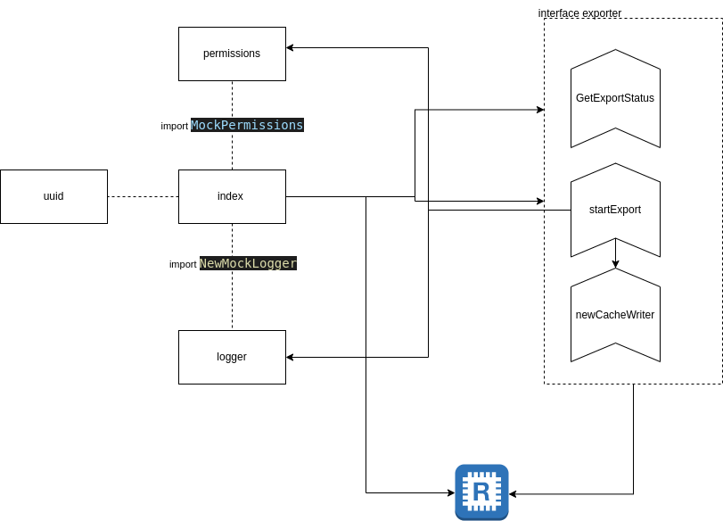

# Heartbeat engineering challenge

## Task1

---

### software design



---

## system description

1. app start by (yarn start or npm start)

2. redis client initiate and HBExporterDependencies created base on redisclient, generated UUID and permission and also logger :

```{
    cache: redisClient,
    UUIDGen: MockUUIDGen,
    allowedPermission: "",
    permissionsService: permissions,
    logger: loggedInfo,
  }
```

3. user create by id and permission list:

```
{
    id: "number",
    permissions: [],
}
```

4. exporter will be create by exporterDeps and StartExport will start working by myUser and file content which is streamed by mockOpenFile()

### StartExport(user,data)

- 4.1. logger log the string "starting export"

- 4.2 permission check using PermissionsService 's CheckPermissions using userinfo and permissions and if not allowed error "incorrect permission" will be thrown

* 4.3. redis exportId key's value will be set

```
{
          status: "CREATED",
          id: generatedNewUUID,
}
```

4.4 write and attach data to stream using function newCacheWriter(exportId,cache):

- 4.4.1: unitl data is available data will be written chunk by chunk to exportedId by passing pending status
- 4.4.2 by finalizing data status COMPLETE will returned and 3600 expire time will be set for exportedId key

5.  while app is run every 500 ms GetExportStatus(id) check the status of export and will get the status based on exportId key of redis cache data
