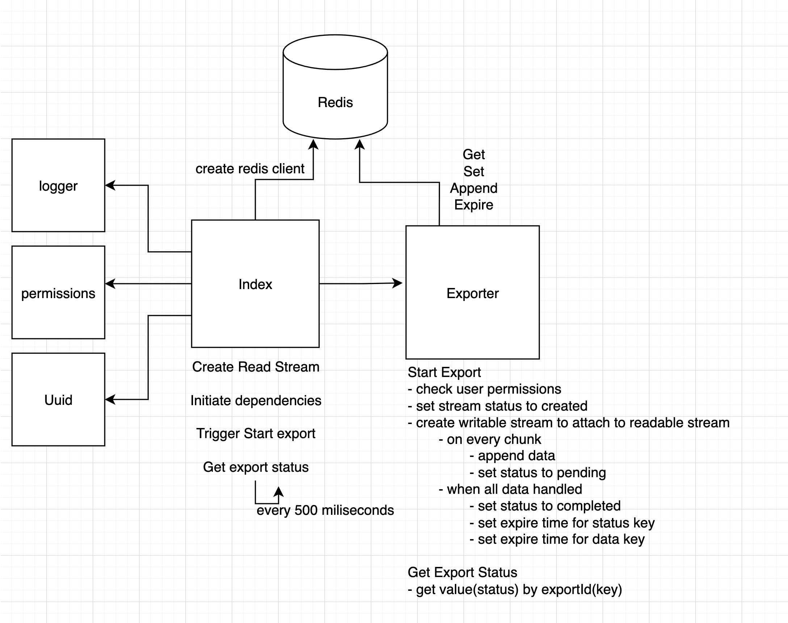

# Heartbeat engineering challenge

> 🚨 Please create a private fork of this repository and make all PRs into your own repository

Thank you for taking part in this and we are excited to see your work!

This repository contains a slimmed down version of an _exporter_ and associated
constructs for mocking functionality. There are three
tasks to complete.

The following files are simple mocks and need not be edited for the purpose
of this exercise.

```
1. src/logger.ts
2. src/permissions.ts
3. src/uuid.ts
```

## Tasks

### Task 1

Complete this README with a description of how the exporter works. You may
also add diagrams/code snippets, whatever you think is required ⭐️

**Tips**

1.  Read through the various files.
2.  Map out the high level system
    architecture and important functionality.
3.  (optional) Add comments to the `src/exporter.ts` file.

**What we are looking for**

1. Clear explanations of what individual elements are.
2. Some parts may be confusing, that's ok. We are looking for a
   thoughtful consideration of the different elements.
3. Your approach to documentation.

---

**System Architecture**



**Description**

1. Creates redis client using
2. Open a mock file by creating a readable stream by calling `mockOpenFile()`
3. Set and initiate all exporter dependencies which includes:

```
cache: RedisClient;
permissionsService: PermissionsService;
allowedPermission: string;
UUIDGen: UUID;
logger: Logger;
```

5. Populate dependencies and trigger start export method using `exporter.StartExport`

```
Input => (user: User, data: Stream)
Output => { status: string; id: string; }
```

6. Get export status every 500 milliseconds `exporter.GetExportStatus`

```
Input => (id: string)
Output => { status: string; id: string; }
```

**How `StartExport` works:**

1. Checks the user permissions using
   ```
   CheckPermissions: async (user, permission) =>
   user.permissions.includes(permission),
   ```
2. Sets key (exportId) in redis with the value `{ status: "CREATED", id: exportId, }`
3. Attach writable stream to readable stream using `data.pipe(newCacheWriter(exportId, deps.cache))`
4. Create writable stream and write data to cache using `newCacheWriter()`
   ```
   Input => (exportId: string, cache: RedisClient)
   Output => Writable stream
   ```
   1. `write()` method of writable stream writes data to stream and chunks will be appended to `{id}-data` key
      1. set status PENDING until all data is handled
   2. After all data is handled `final()` executes
      1. set status to COMPLETE
      2. set expiry times to the keys

**How `GetExportStatus` works:**

1. Gets value from cache using key (Id)
2. If key does not exist throws error else parse the value and returns

---

### Task 2a 🛠

**Please choose either 2a or 2b!**

We need new functionality adding. In addition to starting and fetching the
status of exports. **We would also like to cancel currently running exports**. Please implement
this functionality.

**Tips**

1. _We are looking for a minimum working example_, try focus on getting to something working.
   We can talk through your design and architecture decisions during the next interview.
2. The cancel existing import functionality should ideally **stop** an existing import. So no
   further bytes are piped from data source to the cache.
3. Bonus points for helpful test coverage on new code.

### Task 2b 🧪

**Please choose either 2a or 2b!**

The engineer who implemented this functionality forgot to add tests. We would like to cover
this feature with tests. Please add suitable tests for the exporter.

**Tips**

1. We are looking for how you approach testing code - be prepared to answer questions on why
   certain tests have been added!
2. Test names should be descriptive and help us understand why you chose to write that test.

### Task 3 📈

What would you improve? We know this feature isn't great. What would you change?

**Tips**

1. We are looking for ideas such as patterns, principles and performance.
2. You don't need to implement any improvements, but feel free to use code
   examples where you feel it would be helpful.

## How to submit

1. Create a private fork of this repository
2. Create a new branch in your fork
3. Commit on that branch
4. When you are ready to submit, create a PR back to your fork
5. Add the user @heartbeat-med (https://github.com/heartbeat-med)
6. We will comment on the PR
7. You can either submit more code or we can discuss in the next interview 🤘
8. Any questions, reach out to us!

## Start the application

Run the example with:

```shell
yarn start
```

Format code:

```shell
yarn format
```
